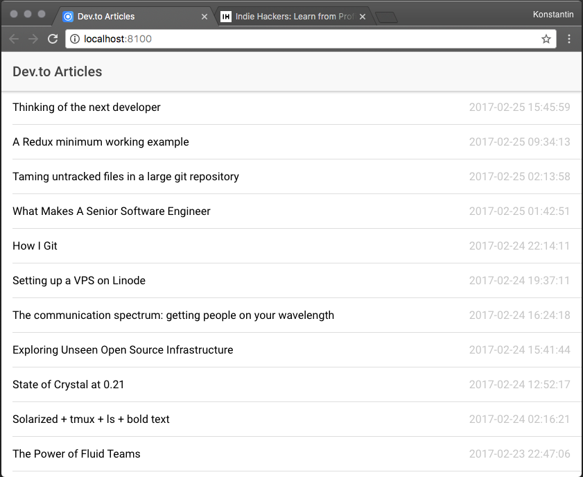

# Ionicframework 2 based app for reading latest from dev.to!

## Installation

```
npm install -g ionic cordova
git clone git@github.com:kpavlovsky/devto_ionic_app.git
cd devto_ionic_app
ionic server
```

This will compile and run app in your default browser!

To compile it for your android device:

```
ionic build android
```

or, if your device is connected: 

```
ionic run android
```

With iOS should be the almost the same, but i don't have iOS device around currently.

## ScreenShots

Browser:




## Roadmap:
* Make it possible to read previously downloaded articles in offline mode


